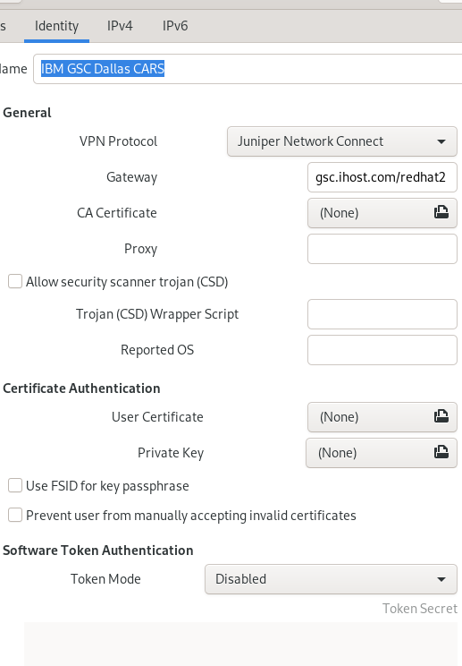
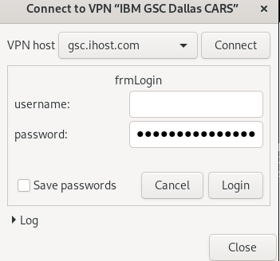

# Step by step guide on how to configure the Coppell CARS Lab VPN in Fedora

You should have received an email like:

```
Welcome to the IBM Global Solution Center.
A GSC VPN User ID has been requested on your behalf by Mike Andreasen
Please follow the link below for instructions for connecting to GSC networks.  Follow the instructions for each VPN address if this note includes more than one.  Specific information for your ID is included in the table below.
https://a.b.c.d:9443/VPN_Documentation.pdf
______________________________________________________________

Network Zone: red
ID: username
Initial Password: password
VPN Address:  https://gsc.ihost.com/redhat2
Days until expiration: 90
Self Service Password Management URL: https://a.b.c.d:9443/ssp/main.php
______________________________________________________________
```

You better reset the password following the VPN_Documentation.pdf instructions
and note the ID and password somewhere.

Then:

* Install `NetworkManager-openconnect-gnome`

```bash
sudo dnf install -y NetworkManager-openconnect-gnome
```

* Configure a new Juniper type VPN connection:

* Select Multi-protocol VPN Client (openconnect)

* Under VPN Protocol Select Juniper Network Connect



* Then you can connect as any other VPN connection with your user & password



* Validate the connection

You can ping the jumphost to validate the connection is properly running:

```bash
ping -c3 172.28.11.51
```
