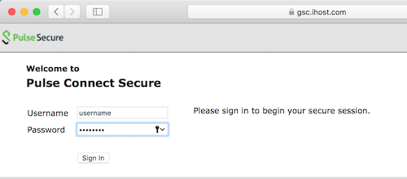
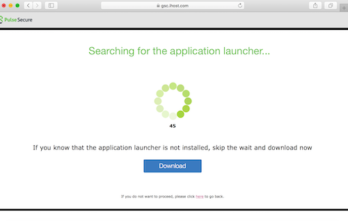
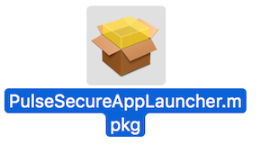
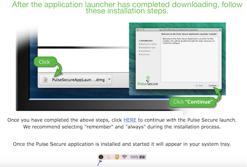
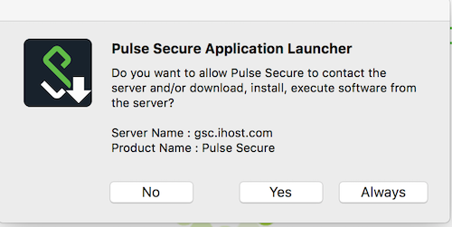
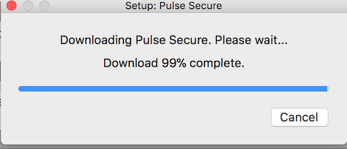
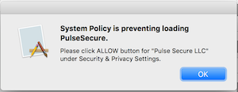
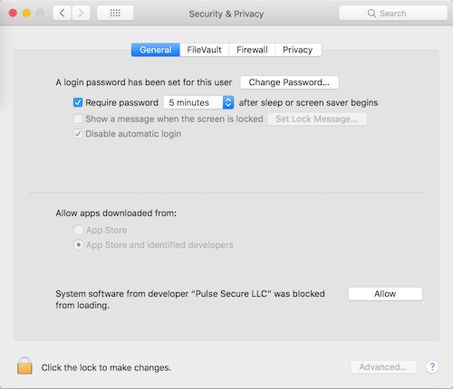

# Step by step guide on how to configure the Coppell CARS Lab VPN in MacOS

You should have received an email like:

```
Welcome to the IBM Global Solution Center.
A GSC VPN User ID has been requested on your behalf by Mike Andreasen
Please follow the link below for instructions for connecting to GSC networks.  Follow the instructions for each VPN address if this note includes more than one.  Specific information for your ID is included in the table below.
https://a.b.c.d:9443/VPN_Documentation.pdf
______________________________________________________________

Network Zone: red
ID: username
Initial Password: password
VPN Address:  https://gsc.ihost.com/redhat2
Days until expiration: 90
Self Service Password Management URL: https://a.b.c.d:9443/ssp/main.php
______________________________________________________________
```

Reset the password following the VPN_Documentation.pdf instructions
and note the ID and password somewhere.

Then:

1. Open your web browser and enter the url: `https://gsc.ihost.com/redhat2`. Login using the username and password you just set.



2. Click Pulse Secure under Client Application Sessions.


3. Click the blue Download button when you see the Searching for application launcher... page.



4. PulseSecureAppLauncher.dmg will have downloaded. Open it and once mounted, double click on PulseSecureAppLauncher.mpkg to begin the install. Click through the installer, at the end you should see an installation successful message. You can unmount and delete the PulseSecureAppLauncher.dmg file.



5. Go back to your web browser and click the blue HERE hyperlink. If you closed your browser window go back to step 1, and skip steps 3 and 4.



6. If you see a pop-up asking to allow the page to open PulseApplicationLauncher, click Allow.


7. When you see a pop-up asking to allow the import of the VPN profile, click Yes.



8. The Pulse Secure Launcher should now begin downloading the client. Enter your MacOS password if prompted to complete the install.



9. You will see one or two pop-ups about allowing the Pulse Secure LLC kext.



10. Open System Preferences > Security and Privacy. Click Allow next to `System software from developer "Pulse Secure LLC" was blocked from loading.` Then click OK on the above pop-up.



11. You should now see the Pulse Secure icon in the system tray and the Pulse Secure client open and connected. :tada:


12. If you need to connect or disconnect just click the icon in the tray. If the icon is not there you can find Pulse Secure in Applications. You may want to disconnect and re-connect so that you can save your password in the client.

13. You can ping the jumphost to validate the connection is properly running:

```bash
ping -c3 172.28.11.51
```
