# Step by step guide on how to configure the Coppell CARS Lab VPN in Windows

You should have received an email like:

```
Welcome to the IBM Global Solution Center.
A GSC VPN User ID has been requested on your behalf by Mike Andreasen
Please follow the link below for instructions for connecting to GSC networks.  Follow the instructions for each VPN address if this note includes more than one.  Specific information for your ID is included in the table below.
https://a.b.c.d:9443/VPN_Documentation.pdf
______________________________________________________________

Network Zone: red
ID: username
Initial Password: password
VPN Address:  https://gsc.ihost.com/redhat2
Days until expiration: 90
Self Service Password Management URL: https://a.b.c.d:9443/ssp/main.php
______________________________________________________________
```

Reset the password following the VPN_Documentation.pdf instructions
and note the ID and password somewhere.

Then:

1. Open your web browser and enter the url: `https://gsc.ihost.com/redhat2`. Login using the username and password you just set.


2. Click Start next to Pulse Secure under Client Application Sessions.

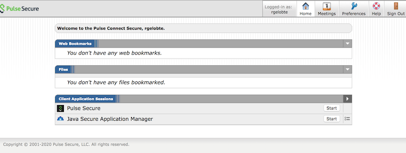

3. Click the blue Download button when you see the Searching for application launcher page.


4. PulseSecureAppLauncher.msi will have downloaded. Double-click to run it and begin the install. Accept any warnings if needed, at the end you should see an installation successful message.


5. Go back to your web browser and click the blue HERE hyperlink. If you closed your browser window go back to step 1, and skip steps 3 and 4.

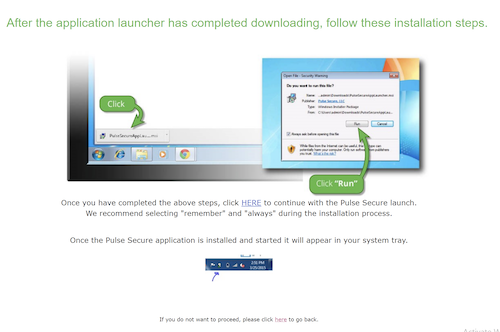

6. If you see a pop-up asking to allow the page to open PulseApplicationLauncher, click Allow.

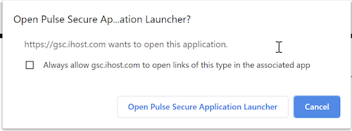

7. Accept any security warnings from the Application Launcher Screen.

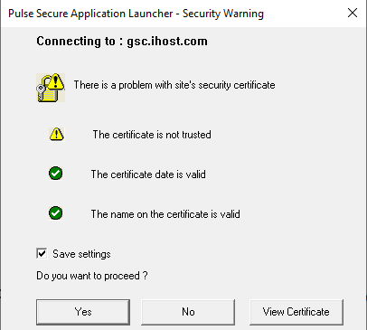

8. When you see a pop-up asking to allow the import of the VPN profile, click Yes.

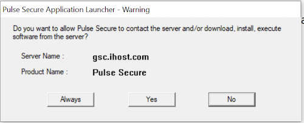

9. The Pulse Secure Launcher should now begin installing the client.

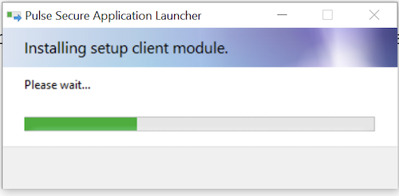

10. You will see a UAC pop-up for PulseSetupClientOCX64.exe, click Yes.

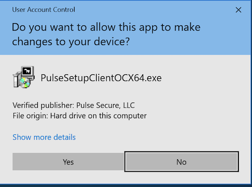

11. You will see a UAC pop-up for Pulse Secure Component Manager Installer click Yes.

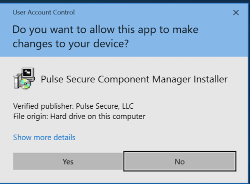

12. You should now see the setup downloading Pulse Secure.

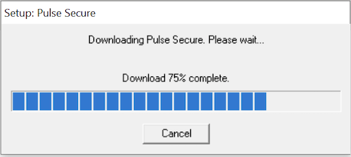

13. You will see a UAC pop-up for Pulse Secure Component Manager Installer again, click Yes.

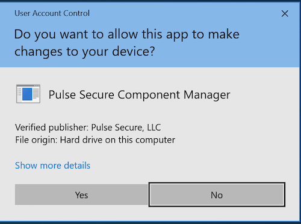

14. The install should complete and you should now see the Pulse Secure icon in the system tray and the Pulse Secure client open and connected. :tada:

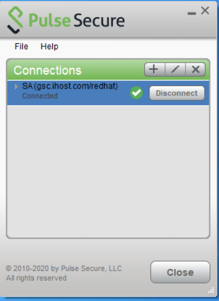

15. If you need to connect or disconnect, just click the icon in the tray. If the icon is not there you can find Pulse Secure in Applications. You may want to disconnect and re-connect so that you can save your password in the client.

15. You can ping the jumphost to validate the connection is properly running:

```bash
ping 172.28.11.51
```
